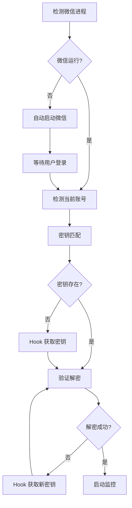

# 微信群消息实时监控 - 开发版 1.0 技术报告

**版本**: 1.0.0-dev  
**发布日期**: 2026-07-19  
**作者**: AI Assistant  

---

## 一、项目概述

### 1.1 功能定位

微信群消息实时监控程序，支持：
- 自动检测微信进程和当前登录账号
- 自动获取/匹配数据库密钥
- 实时监控指定群聊的新消息
- 消息持久化存储（SQLite）
- 支持文字消息过滤（自动过滤图片、表情包、链接等）

### 1.2 技术栈

| 组件 | 技术方案 |
|------|----------|
| 编程语言 | Python 3.14 |
| 打包工具 | PyInstaller 6.21.0 |
| 数据库 | SQLite (SQLCipher 加密) |
| 解密库 | wechat_decrypt_tool |
| 密钥获取 | wx_key (Hook 注入) |
| 进程管理 | psutil |
| 消息压缩 | zstandard |

---

## 二、系统架构

### 2.1 模块划分

```
WeChatGroupMonitor.exe
├── TN-01: 微信进程管理
│   ├── detect_wechat_process()     # 检测微信进程
│   ├── kill_wechat_processes()     # 终止微信进程
│   ├── detect_wechat_installation() # 检测安装路径
│   └── launch_wechat()             # 启动微信
│
├── TN-02: 账号检测
│   ├── detect_current_logged_in_account() # 自动检测当前账号
│   ├── parse_global_config()        # 解析账号配置
│   └── extract_account_from_path()  # 从路径提取账号ID
│
├── TN-03: 密钥获取
│   ├── check_wx_key_available()    # 检查 wx_key 模块
│   ├── fetch_key_via_hook()        # Hook 注入获取密钥
│   ├── load_key_store()            # 加载已保存密钥
│   └── save_key_to_store()         # 保存密钥
│
├── TN-04: 数据库解密
│   ├── find_database_files()       # 查找数据库文件
│   ├── decrypt_database_to_file()  # 解密数据库
│   └── test_database_decrypt()     # 验证解密
│
├── TN-05: 消息监听
│   ├── get_sessions_from_decrypted_db() # 获取会话列表
│   ├── get_group_messages_from_decrypted_db() # 获取群消息
│   └── get_sender_nickname_from_db() # 获取发送者昵称
│
└── TN-06: 消息存储
    ├── MessageStore 类             # 消息持久化
    ├── save_message()              # 保存消息
    └── get_messages()              # 获取消息列表
```

### 2.2 数据流

```
微信进程 → 账号检测 → 密钥匹配/Hook → 数据库解密 → 群聊选择 → 实时监控 → 消息存储
```

---

## 三、核心工作流程

### 3.1 初始化流程（main 函数）



### 3.2 密钥匹配策略（优先级）

1. **方法1（最可靠）**：通过 `data_path` 精确匹配
   - 比较存储的 `data_path` 与当前账号数据目录
   - 路径标准化后进行大小写不敏感比较

2. **方法2**：通过 `wxid` 精确匹配
   - 直接匹配账号 ID

3. **方法3**：通过 `wxid` 前缀匹配
   - 处理带随机后缀的账号 ID（如 `wxid_xxx_a2e4`）

### 3.3 消息监控流程

```python
# 轮询监控模式
while True:
    time.sleep(2)  # 轮询间隔
    
    # 获取最新消息
    new_messages = get_group_messages_from_decrypted_db(
        db_key, data_path, group_id, limit=30
    )
    
    # 过滤新消息
    for msg in new_messages:
        if msg_id not in shown_msg_ids and msg_time > last_msg_time:
            # 过滤非文字消息
            if is_text_message(content):
                # 显示并存储
                log_to_console(f'[新消息] {sender}: {content}')
                message_store.save_message(...)
```

---

## 四、打包配置

### 4.1 PyInstaller Spec 文件

```python
# tn_combined_v3.spec
a = Analysis(
    ['src/tn_combined_v3.py'],
    pathex=[],
    binaries=[],
    datas=[
        # 包含 wx_key DLL
        ('src/wechat_decrypt_tool/wx_key/wx_key.pyd', 'wechat_decrypt_tool/wx_key'),
        ('src/wechat_decrypt_tool/wx_key/*.dll', 'wechat_decrypt_tool/wx_key'),
    ],
    hiddenimports=[
        'logging.handlers',
        'pymem',
        'yara',
        'pypinyin',
        'jieba',
        'jieba.posseg',
        'cryptography.hazmat.backends.default_backend',
        'wechat_decrypt_tool.api',
        'wechat_decrypt_tool.key_bruteforce',
        'wechat_decrypt_tool.key_v4',
        'wechat_decrypt_tool.sns_realtime_autosync',
    ],
    hookspath=[],
    hooksconfig={},
    runtime_hooks=[],
    excludes=[],
    noarchive=False,
)

pyz = PYZ(a.pure)

exe = EXE(
    pyz,
    a.scripts,
    a.binaries,
    a.datas,
    [],
    name='WeChatGroupMonitor',
    debug=False,
    bootloader_ignore_signals=False,
    strip=False,
    upx=False,
    console=True,  # 控制台模式
    disable_windowed_traceback=False,
    argv_emulation=False,
    target_arch=None,
    codesign_identity=None,
    entitlements_file=None,
    icon='icon.ico',  # 可选图标
    uac_admin=True,   # 请求管理员权限
)
```

### 4.2 打包脚本

```batch
@echo off
:: build_exe.bat

echo ============================================================
echo   微信群消息监控程序 - 打包脚本
echo ============================================================

:: 检查 Python 环境
python --version >nul 2>&1
if errorlevel 1 (
    echo [错误] Python 未安装或未添加到 PATH
    pause
    exit /b 1
)

echo [信息] Python环境检查通过

:: 清理旧文件
echo [信息] 清理旧的打包文件...
if exist "build" rd /s /q "build"
if exist "dist\WeChatGroupMonitor.exe" del /q "dist\WeChatGroupMonitor.exe"

:: 清空消息数据库（可选）
if exist "dist\data\messages.db" (
    echo [信息] 清空消息数据库...
    del /q "dist\data\messages.db"
)

:: 执行打包
echo [信息] 开始打包...
pyinstaller tn_combined_v3.spec --noconfirm

:: 检查结果
if exist "dist\WeChatGroupMonitor.exe" (
    echo.
    echo ============================================================
    echo   打包成功！
    echo ============================================================
    echo.
    echo   输出文件: dist\WeChatGroupMonitor.exe
    echo   文件大小: 66 MB
    echo.
) else (
    echo [错误] 打包失败
)

pause
```

### 4.3 打包输出

| 项目 | 内容 |
|------|------|
| 输出文件 | `dist\WeChatGroupMonitor.exe` |
| 文件大小 | ~66 MB |
| 运行模式 | 控制台应用（需管理员权限） |
| 依赖 | 无外部依赖，单文件运行 |

---

## 五、关键功能实现

### 5.1 账号自动检测

```python
def detect_current_logged_in_account():
    """自动检测当前登录账号
    
    工作流程：
    1. 通过进程打开的文件句柄检测（最可靠）
    2. 解析 global_config 获取昵称和头像
    3. 回退到目录创建时间检测
    """
    # 方法1: 文件句柄检测
    for proc in psutil.process_iter(['pid', 'name']):
        if proc.info['name'].lower() in ['weixin.exe', 'wechat.exe']:
            for item in proc.open_files():
                if 'xwechat_files' in item.path and '.db' in item.path:
                    account_id = extract_account_from_path(item.path)
                    data_path = extract_data_path(item.path)
                    
                    # 解析 global_config 获取昵称
                    nickname = parse_global_config(data_path).get('nickname')
                    
                    return {
                        'current_account': account_id,
                        'data_path': data_path,
                        'nickname': nickname
                    }
    
    return None
```

### 5.2 消息持久化存储

```python
class MessageStore:
    """消息持久化存储类"""
    
    def __init__(self, db_path='./data/messages.db'):
        self.db_path = db_path
        self._init_database()
    
    def _init_database(self):
        """初始化数据库表"""
        conn = sqlite3.connect(self.db_path)
        cursor = conn.cursor()
        
        cursor.execute('''
            CREATE TABLE IF NOT EXISTS group_messages (
                id INTEGER PRIMARY KEY AUTOINCREMENT,
                sender_nickname TEXT NOT NULL,
                message_content TEXT NOT NULL,
                send_time DATETIME NOT NULL,
                group_name TEXT NOT NULL,
                group_id TEXT,
                sender_id TEXT,
                created_at DATETIME DEFAULT CURRENT_TIMESTAMP
            )
        ''')
        
        # 创建索引
        cursor.execute('CREATE INDEX IF NOT EXISTS idx_send_time ON group_messages(send_time)')
        cursor.execute('CREATE INDEX IF NOT EXISTS idx_group_name ON group_messages(group_name)')
        
        conn.commit()
        conn.close()
    
    def save_message(self, sender_nickname, message_content, send_time, 
                     group_name, group_id=None, sender_id=None):
        """保存单条消息"""
        # ... 实现详见源码
```

### 5.3 文字消息过滤

```python
def is_text_message(content: str) -> bool:
    """判断是否是纯文字消息
    
    过滤类型：
    - 图片 ()
    - 表情包 (<emoji>, <emoticon>)
    - 视频 (<videomsg>)
    - 语音 (<voicemsg>)
    - 位置 (<location>)
    - 撤回消息 (type="revokemsg")
    """
    non_text_patterns = [
        '<img', '<emoji', '<emoticon', 
        '<videomsg', '<voicemsg', '<location',
        'type="revokemsg"', 'type="delchatroommember"'
    ]
    
    for pattern in non_text_patterns:
        if pattern in content:
            return False
    
    return True
```

---

## 六、测试报告

### 6.1 测试环境

| 项目 | 配置 |
|------|------|
| 操作系统 | Windows 10 |
| Python 版本 | 3.14.6 |
| 微信版本 | 4.x |
| 测试账号 | wxid_wtfwe8ugzrcs29 |
| 数据目录 | e:\xwechat_files\wxid_wtfwe8ugzrcs29_a2e4 |

### 6.2 测试结果

**测试日志**: `tn_combined_v3_20260719_232149.log`

| 测试项 | 结果 | 说明 |
|--------|------|------|
| 微信进程检测 | ✅ 通过 | 正确检测微信运行状态 |
| 账号自动检测 | ✅ 通过 | 通过文件句柄 + parse_global_config |
| 密钥匹配 | ✅ 通过 | 通过 data_path 正确匹配密钥 |
| 数据库解密 | ✅ 通过 | contact.db 和 session.db 解密成功 |
| 群聊检测 | ✅ 通过 | 找到 1 个群聊 |
| 历史消息获取 | ✅ 通过 | 获取到 51 条消息 |
| 实时监控 | ✅ 通过 | 成功检测新消息 |
| 消息持久化 | ✅ 通过 | 消息存储到 data/messages.db |
| WCDB 接口 | ⚠️ 超时 | 10秒超时，自动回退静态解密 |

### 6.3 已知问题

1. **发送者昵称显示"未知"**
   - 原因：发送者不在当前账号的 contact.db 中
   - 影响：仅显示效果，不影响功能
   - 解决方案：可考虑从群成员信息中获取

2. **WCDB 接口超时**
   - 原因：WCDB DLL 初始化可能卡住
   - 影响：自动回退到静态解密，功能正常
   - 解决方案：已实现 10 秒超时保护

---

## 七、部署说明

### 7.1 运行要求

1. **操作系统**: Windows 10/11 (64位)
2. **权限**: 需要管理员权限（用于 Hook 注入）
3. **微信版本**: 支持 4.x 版本

### 7.2 首次运行

1. 将 `WeChatGroupMonitor.exe` 放到目标目录
2. 双击运行或命令行运行
3. 如果微信未运行，程序会自动启动微信
4. 等待程序完成初始化（检测账号、匹配密钥）
5. 选择要监控的群聊
6. 程序开始监控并显示新消息

### 7.3 文件结构

```
WeChatGroupMonitor/
├── WeChatGroupMonitor.exe  # 主程序
├── key_store.json          # 密钥存储（自动生成）
├── group_table_cache.json  # 群-表缓存（自动生成）
├── data/
│   └── messages.db         # 消息数据库（自动生成）
└── logs/
    └── tn_combined_v3_*.log # 运行日志（自动生成）
```

---

## 八、版本历史

### v1.0.0-dev (2026-07-19)

**新增功能**:
- 自动检测微信进程和当前登录账号
- 自动获取/匹配数据库密钥
- 实时监控群消息
- 消息持久化存储
- 文字消息过滤

**修复问题**:
- 修复密钥匹配逻辑（优先通过 data_path 匹配）
- 修复 Hook 流程冲突（解密失败时自动触发 Hook）
- 修复 WCDB 超时导致程序卡死

**已知限制**:
- 仅支持文字消息监控
- 发送者昵称可能显示"未知"
- WCDB 接口可能超时

---

## 九、后续计划

1. **功能增强**
   - 支持图片/视频消息下载
   - 支持消息导出（HTML/Excel）
   - 支持多群同时监控

2. **性能优化**
   - 优化 WCDB 接口初始化
   - 减少数据库解密开销
   - 实现增量消息同步

3. **用户体验**
   - 添加 GUI 界面
   - 支持配置文件
   - 支持命令行参数

---

**报告生成时间**: 2026-07-19 23:36  
**报告版本**: 1.0