# WeChatDataAnalysis 项目运行流程图

**文档日期：** 2026年7月20日  
**版本：** v1.0

---

## 一、系统整体架构流程图

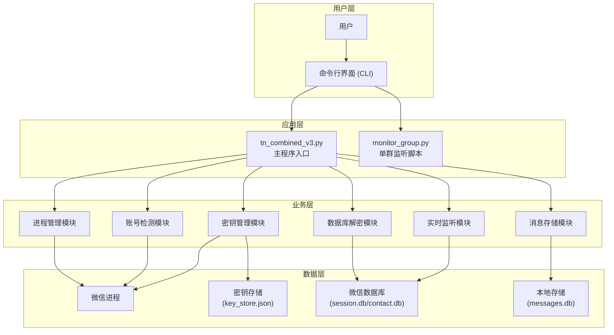

---

## 二、主程序启动流程图

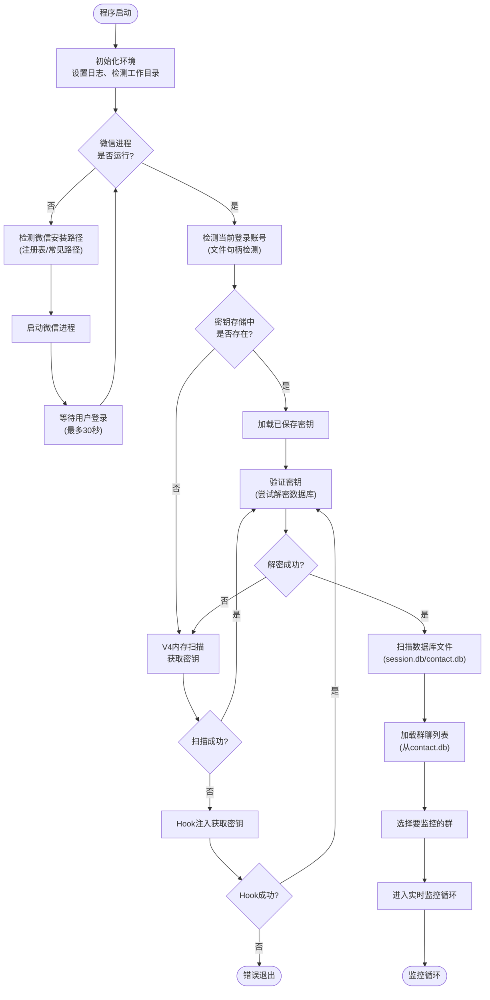

---

## 三、密钥获取与匹配流程图

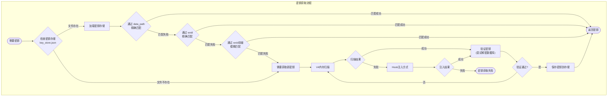

---

## 四、实时消息监听流程图

```mermaid
flowchart TD
    subgraph 监控循环["实时监控循环"]
        START_MONITOR([开始监控]) --> CONNECT_WCDB["连接WCDB数据库<br/>(open_account)"]
        CONNECT_WCDB --> GET_HISTORY["获取历史消息<br/>(最近100条)"]
        GET_HISTORY --> PARSE_HISTORY["解析历史消息<br/>(解码zstd压缩)"]
        PARSE_HISTORY --> SET_BASELINE["设置基准时间戳<br/>(last_create_time)"]
        
        SET_BASELINE --> POLL_LOOP{"轮询循环"}
        
        POLL_LOOP --> SLEEP["等待轮询间隔<br/>(自适应0.5-5秒)"]
        SLEEP --> GET_NEW["获取最新消息<br/>(limit=30)"]
        
        GET_NEW --> FILTER_NEW["过滤新消息<br/>(时间戳 > last_create_time)"]
        FILTER_NEW --> HAS_NEW{"有新消息?"}
        
        HAS_NEW -->|是| PROCESS_MSG["处理新消息"]
        HAS_NEW -->|否| ADJUST_INTERVAL["调整轮询间隔<br/>(延长)"]
        
        PROCESS_MSG --> DECODE_MSG["解码消息内容<br/>(zstd解压)"]
        DECODE_MSG --> CHECK_TYPE{"消息类型判断"}
        
        CHECK_TYPE -->|文字消息| DISPLAY_MSG["显示消息"]
        CHECK_TYPE -->|非文字| FILTER_MSG["过滤消息"]
        
        DISPLAY_MSG --> GET_SENDER["获取发送者昵称"]
        GET_SENDER --> SAVE_MSG["保存到本地数据库"]
        SAVE_MSG --> UPDATE_TIME["更新last_create_time"]
        
        FILTER_MSG --> UPDATE_TIME
        UPDATE_TIME --> SHORTEN_INTERVAL["缩短轮询间隔<br/>(快速响应)"]
        
        SHORTEN_INTERVAL --> POLL_LOOP
        ADJUST_INTERVAL --> POLL_LOOP
        
        POLL_LOOP -->|用户中断| CLEANUP["清理资源"]
        CLEANUP --> CLOSE_WCDB["关闭WCDB连接"]
        CLOSE_WCDB --> STOP_MONITOR([监控停止])
    end
```

---

## 五、数据库解密流程图

```mermaid
flowchart TD
    subgraph 解密流程["SQLCipher数据库解密"]
        START_DECRYPT([开始解密]) --> READ_FILE["读取加密数据库文件"]
        READ_FILE --> CALC_PAGES["计算总页数<br/>(文件大小 / 4096)"]
        
        CALC_PAGES --> LOOP_PAGES["遍历每一页"]
        
        LOOP_PAGES --> READ_PAGE["读取页面数据<br/>(4096字节)"]
        READ_PAGE --> EXTRACT_IV["提取IV<br/>(前16字节)"]
        EXTRACT_IV --> EXTRACT_HMAC["提取HMAC<br/>(后64字节)"]
        EXTRACT_HMAC --> GET_ENCRYPTED["获取加密内容<br/>(去掉IV和HMAC)"]
        
        GET_ENCRYPTED --> AES_DECRYPT["AES-256-CBC解密"]
        AES_DECRYPT --> REMOVE_PADDING["移除PKCS7填充"]
        REMOVE_PADDING --> APPEND_PAGE["追加到解密数据"]
        
        APPEND_PAGE --> MORE_PAGES{"还有更多页面?"}
        MORE_PAGES -->|是| LOOP_PAGES
        MORE_PAGES -->|否| WRITE_FILE["写入解密后文件"]
        
        WRITE_FILE --> VERIFY_DB["验证数据库完整性<br/>(PRAGMA quick_check)"]
        VERIFY_DB --> VERIFY_OK{"验证通过?"}
        
        VERIFY_OK -->|是| SUCCESS([解密成功])
        VERIFY_OK -->|否| FAIL([解密失败])
    end
```

---

## 六、消息内容解码流程图

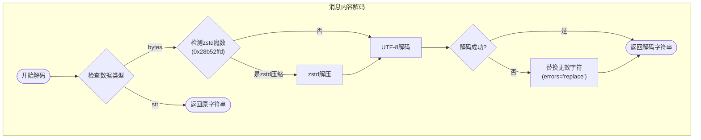

---

## 七、账号检测流程图

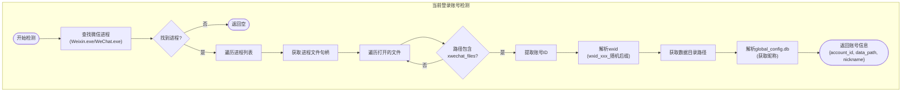

---

## 八、群聊选择与消息处理流程图

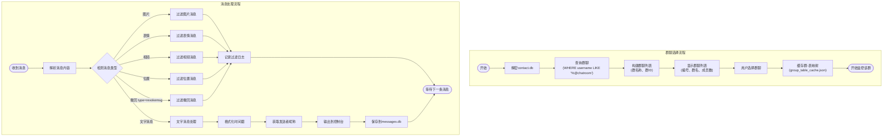

---

## 九、自适应轮询算法流程图

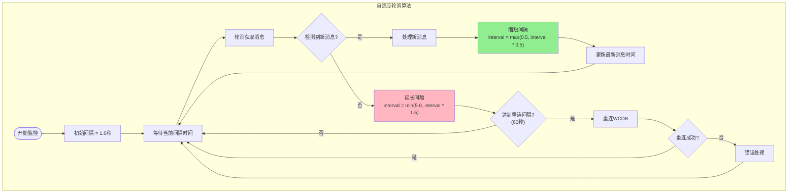

---

## 十、文件读写与数据流图

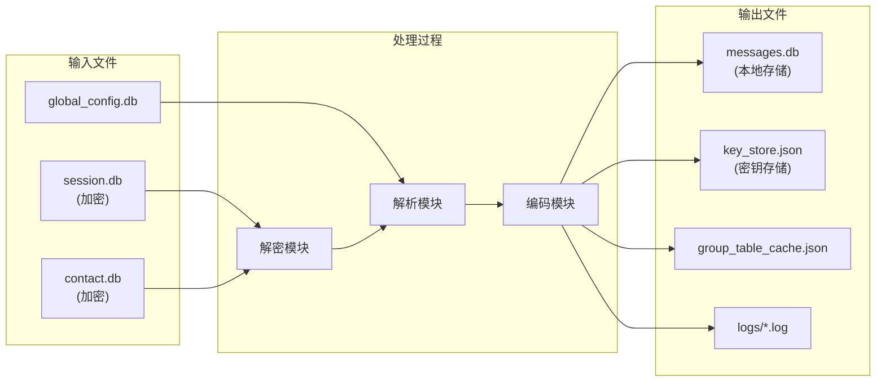

---

## 十一、错误处理与重试机制流程图

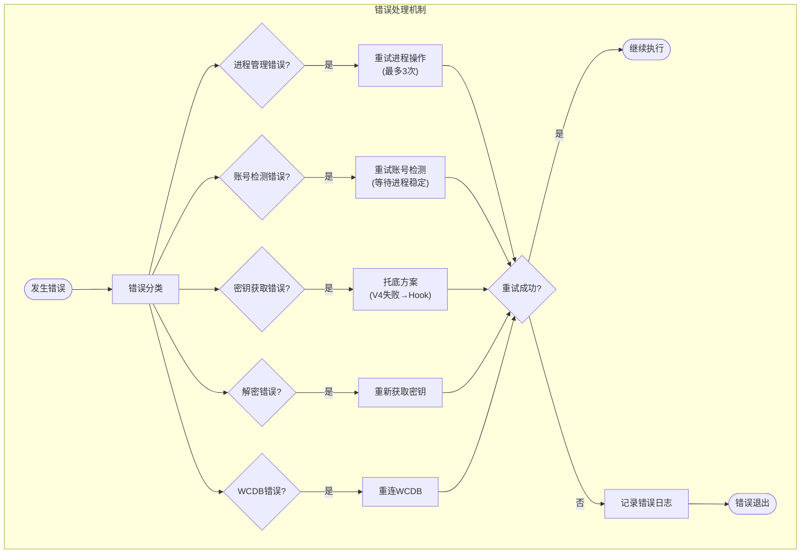

---

## 十二、模块调用时序图

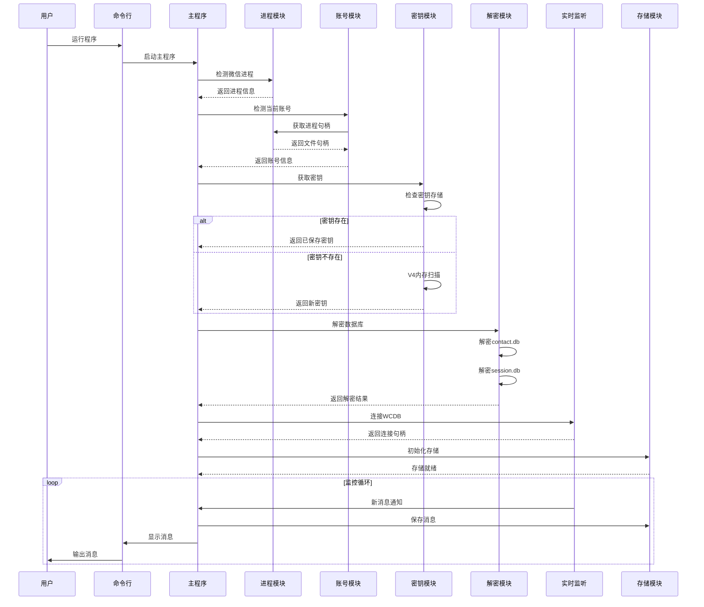

---

**文档生成时间：** 2026年7月20日 14:25  
**文档版本：** v1.0