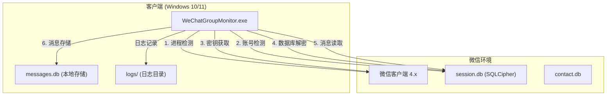
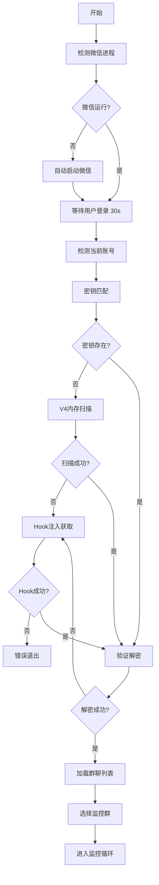

# WeChatDataAnalysis 技术规格与编码固化报告

## 1. 文档信息

| 项目 | 内容 |
|------|------|
| **版本** | v1.0（固化版） |
| **基于的测试** | TEST_RUN_REPORT_TN_COMBINED_V3_20260719.md / TEST_RUN_REPORT_FINAL_20260719.md |
| **固化日期** | 2026-07-20 |
| **面向人员** | 后端/全栈开发工程师 |
| **项目名称** | WeChatDataAnalysis - 微信群消息监听系统 |

---

## 2. 总体设计结论

### 2.1 架构模式

采用**单体分层架构**，按技术节点划分模块：

```
┌─────────────────────────────────────────────────────────────┐
│                    表现层 (Presentation)                     │
│                  tn_combined_v3.py (CLI)                    │
├─────────────────────────────────────────────────────────────┤
│                    业务层 (Business)                         │
│    monitor_group.py / chat_realtime_reader.py               │
├─────────────────────────────────────────────────────────────┤
│                    数据访问层 (Data Access)                   │
│         wcdb_realtime.py / wechat_decrypt.py                │
├─────────────────────────────────────────────────────────────┤
│                    基础设施层 (Infrastructure)                │
│    key_v4.py / key_store.py / wechat_detection.py           │
└─────────────────────────────────────────────────────────────┘
```

### 2.2 技术栈最终选型

| 层级 | 技术选型 | 版本 | 说明 |
|------|----------|------|------|
| 编程语言 | Python | 3.11+ | 类型提示、异步支持 |
| 打包工具 | PyInstaller | 6.21.0 | 单文件打包 |
| 数据库 | SQLite (SQLCipher) | 4.x | 加密数据库 |
| 加密算法 | AES-256-CBC | - | 微信数据库加密 |
| 密钥派生 | PBKDF2-SHA512 | - | 256000次迭代 |
| 进程管理 | psutil | 5.9+ | 跨平台进程操作 |
| 内存操作 | pymem | 1.12+ | V4内存扫描 |
| 消息压缩 | zstandard | 0.21+ | 微信消息解压 |
| Hook注入 | wx_key | 0.1+ | 密钥获取托底 |

### 2.3 部署拓扑简图



---

## 3. 模块划分与职责表

| 模块名称 | 职责描述 | 技术节点 | 对应代码包/文件 |
|----------|----------|----------|----------------|
| **wechat_detection** | 微信进程管理、账号检测 | TN-01, TN-02 | `wechat_decrypt_tool/wechat_detection.py` |
| **key_v4** | V4内存扫描密钥获取 | TN-03 | `wechat_decrypt_tool/key_v4.py` |
| **key_store** | 密钥持久化存储 | TN-03 | `wechat_decrypt_tool/key_store.py` |
| **wechat_decrypt** | SQLCipher数据库解密 | TN-04 | `wechat_decrypt_tool/wechat_decrypt.py` |
| **wcdb_realtime** | WCDB实时消息监听 | TN-05 | `wechat_decrypt_tool/wcdb_realtime.py` |
| **message_storage** | 消息持久化存储 | TN-06 | `wechat_decrypt_tool/message_storage.py` |
| **tn_combined_v3** | 主程序入口、流程编排 | 全节点 | `src/tn_combined_v3.py` |
| **monitor_group** | 单群实时监听脚本 | TN-05, TN-06 | `monitor_group.py` |

---

## 4. 接口规格固化（API Contract）

### 4.1 内部模块接口

> 本项目为单体应用，以下为模块间调用接口规格。

#### 4.1.1 进程管理接口

```python
# 模块: wechat_detection
# 接口: detect_wechat_process()

def detect_wechat_process() -> list[dict]:
    """
    检测微信进程
    
    Returns:
        list[dict]: 进程信息列表
            - pid: int - 进程ID
            - name: str - 进程名 (Weixin.exe / WeChat.exe)
            - exe: str - 可执行文件路径
    
    状态码:
        - SUCCESS: 返回非空列表表示检测到进程
        - NO_PROCESS: 返回空列表表示无微信进程
    
    性能要求: P99 < 500ms
    """
```

#### 4.1.2 账号检测接口

```python
# 模块: wechat_detection
# 接口: detect_current_logged_in_account()

def detect_current_logged_in_account() -> dict | None:
    """
    检测当前登录账号
    
    Returns:
        dict | None: 账号信息
            - current_account: str - 账号ID (wxid_xxx)
            - data_path: str - 数据目录路径
            - nickname: str - 昵称
            - method: str - 检测方法 (file_handle/process_path)
    
    错误码:
        - ERR_ACCOUNT_001: 无微信进程
        - ERR_ACCOUNT_002: 无法获取文件句柄
        - ERR_ACCOUNT_003: 数据目录不存在
    
    性能要求: P99 < 2s
    """
```

#### 4.1.3 密钥获取接口

```python
# 模块: key_v4 / key_store
# 接口: recover_key_from_memory() / load_account_keys_store()

def recover_key_from_memory(pid: int, db_path: str) -> str | None:
    """
    从进程内存恢复密钥
    
    Args:
        pid: 微信进程ID
        db_path: 数据库文件路径 (用于验证)
    
    Returns:
        str | None: 64位十六进制密钥字符串
    
    错误码:
        - ERR_KEY_001: 进程不存在
        - ERR_KEY_002: 内存扫描失败
        - ERR_KEY_003: 密钥验证失败
    
    性能要求: P99 < 30s (首次获取)
    """

def load_account_keys_store() -> dict:
    """
    加载已保存的密钥存储
    
    Returns:
        dict: 密钥存储字典
            {
                "accounts": {
                    "wxid_xxx": {
                        "db_key": "hex_string",
                        "nickname": "昵称",
                        "data_path": "路径",
                        "last_updated": "ISO时间"
                    }
                }
            }
    
    错误码:
        - ERR_KEYSTORE_001: 存储文件不存在
        - ERR_KEYSTORE_002: JSON解析失败
    """
```

#### 4.1.4 数据库解密接口

```python
# 模块: wechat_decrypt
# 接口: WeChatDatabaseDecryptor

class WeChatDatabaseDecryptor:
    """
    微信数据库解密器
    
    加密参数:
        - 算法: AES-256-CBC
        - 页面大小: 4096 字节
        - IV大小: 16 字节
        - HMAC大小: 64 字节
    """
    
    def __init__(self, key_hex: str):
        """
        初始化解密器
        
        Args:
            key_hex: 64位十六进制密钥字符串
        """
    
    def decrypt_database(self, db_path: str, output_path: str) -> bool:
        """
        解密数据库文件
        
        Args:
            db_path: 加密的数据库文件路径
            output_path: 解密后输出路径
        
        Returns:
            bool: 解密是否成功
        
        错误码:
            - ERR_DECRYPT_001: 密钥格式错误
            - ERR_DECRYPT_002: 文件不存在
            - ERR_DECRYPT_003: 解密失败 (密钥错误)
            - ERR_DECRYPT_004: 写入失败
        
        性能要求: 
            - 1MB文件: P99 < 1s
            - 100MB文件: P99 < 30s
        """
```

#### 4.1.5 实时消息监听接口

```python
# 模块: wcdb_realtime
# 接口: open_account / get_messages

def open_account(db_path: str, key_hex: str) -> int:
    """
    打开WCDB数据库连接
    
    Args:
        db_path: session.db文件路径
        key_hex: 解密密钥
    
    Returns:
        int: 连接句柄 (handle > 0 表示成功)
    
    错误码:
        - ERR_WCDB_001: 数据库文件不存在
        - ERR_WCDB_002: 密钥错误
        - ERR_WCDB_003: Sidecar启动失败
    
    性能要求: P99 < 10s
    """

def get_messages(handle: int, session_id: str, limit: int = 100) -> list[dict]:
    """
    获取会话消息
    
    Args:
        handle: 连接句柄
        session_id: 会话ID (群ID)
        limit: 返回消息数量限制
    
    Returns:
        list[dict]: 消息列表
            {
                "create_time": int,      # 时间戳
                "message_content": str,  # 消息内容
                "sender_username": str,  # 发送者ID
                "local_id": int          # 消息ID
            }
    
    错误码:
        - ERR_WCDB_004: 无效句柄
        - ERR_WCDB_005: 会话不存在
    
    性能要求: P99 < 500ms
    """
```

---

## 5. 数据模型固化

### 5.1 数据库类型及版本

| 数据库 | 类型 | 版本 | 用途 |
|--------|------|------|------|
| session.db | SQLCipher | 4.x | 微信会话数据库 |
| contact.db | SQLCipher | 4.x | 微信联系人数据库 |
| messages.db | SQLite | 3.x | 本地消息存储 |

### 5.2 核心表结构 DDL

#### 5.2.1 消息存储表（本地）

```sql
CREATE TABLE IF NOT EXISTS group_messages (
    id INTEGER PRIMARY KEY AUTOINCREMENT,
    sender_nickname TEXT NOT NULL,           -- 发送者昵称
    message_content TEXT NOT NULL,           -- 消息内容
    send_time DATETIME NOT NULL,             -- 发送时间
    group_name TEXT NOT NULL,                -- 群名称
    group_id TEXT,                           -- 群ID
    sender_id TEXT,                          -- 发送者ID
    created_at DATETIME DEFAULT CURRENT_TIMESTAMP  -- 记录创建时间
);

-- 索引
CREATE INDEX IF NOT EXISTS idx_send_time ON group_messages(send_time);
CREATE INDEX IF NOT EXISTS idx_group_name ON group_messages(group_name);
CREATE INDEX IF NOT EXISTS idx_sender_nickname ON group_messages(sender_nickname);
```

#### 5.2.2 密钥存储结构（JSON文件）

```json
{
    "accounts": {
        "wxid_xxx": {
            "db_key": "64位十六进制字符串",
            "nickname": "用户昵称",
            "data_path": "E:\\xwechat_files\\wxid_xxx_a2f9",
            "last_updated": "2026-07-20T09:00:00"
        }
    },
    "aliases": {
        "自定义ID": "wxid_xxx"
    }
}
```

#### 5.2.3 微信数据库表结构（参考）

```sql
-- contact.db 核心表
CREATE TABLE contact (
    username TEXT PRIMARY KEY,      -- 联系人ID
    nick_name TEXT,                 -- 昵称
    remark TEXT,                    -- 备注
    alias TEXT,                     -- 微信号
    type INT                        -- 类型 (1=个人, 2=群, 3=公众号)
);

-- session.db 核心表
CREATE TABLE SessionTable (
    username TEXT PRIMARY KEY,      -- 会话ID
    type INT,                       -- 会话类型
    unread_count INT,               -- 未读数
    summary TEXT,                   -- 最后一条消息摘要
    last_timestamp INT,             -- 最后消息时间戳
    sort_timestamp INT              -- 排序时间戳
);

-- 消息表 (Msg_xxx)
CREATE TABLE Msg_xxx (
    local_id INTEGER PRIMARY KEY,
    create_time INT,                -- 创建时间戳
    message_content BLOB,           -- 消息内容 (可能zstd压缩)
    real_sender_id INT,             -- 发送者索引
    senderUsername TEXT,            -- 发送者ID (可能为空)
    type INT                        -- 消息类型
);
```

### 5.3 文件存储规范

| 文件类型 | 存储位置 | 格式 | 说明 |
|----------|----------|------|------|
| 密钥存储 | `key_store.json` | JSON | 账号密钥映射 |
| 群表缓存 | `group_table_cache.json` | JSON | 群ID-消息表映射 |
| 消息数据库 | `data/messages.db` | SQLite | 本地消息存储 |
| 运行日志 | `logs/*.log` | Text | UTF-8编码日志 |

---

## 6. 核心业务流程与算法伪代码

### 6.1 初始化流程



### 6.2 密钥匹配算法

```python
def match_key_for_account(account_id: str, data_path: str) -> str | None:
    """
    密钥匹配算法（优先级）
    
    算法步骤:
    1. 加载 key_store.json
    2. 尝试通过 data_path 精确匹配
    3. 尝试通过 wxid 精确匹配
    4. 尝试通过 wxid 前缀匹配 (处理随机后缀)
    5. 返回匹配的密钥或 None
    """
    store = load_account_keys_store()
    
    # 方法1: data_path 精确匹配（最可靠）
    normalized_path = normalize_path(data_path)
    for account_data in store.get("accounts", {}).values():
        stored_path = normalize_path(account_data.get("data_path", ""))
        if stored_path == normalized_path:
            return account_data.get("db_key")
    
    # 方法2: wxid 精确匹配
    if account_id in store.get("accounts", {}):
        return store["accounts"][account_id].get("db_key")
    
    # 方法3: wxid 前缀匹配
    wxid_prefix = account_id.split("_")[0] + "_" + account_id.split("_")[1]
    for stored_id, account_data in store.get("accounts", {}).items():
        if stored_id.startswith(wxid_prefix):
            return account_data.get("db_key")
    
    return None
```

### 6.3 消息监听循环

```python
def monitor_loop(handle: int, group_id: str, interval: float = 1.0):
    """
    实时消息监听循环（自适应轮询）
    
    算法:
    1. 获取初始最新消息时间戳
    2. 进入轮询循环
    3. 有新消息时: 缩短轮询间隔 (最小0.5s)
    4. 无新消息时: 延长轮询间隔 (最大5s)
    5. 每隔60秒检查连接状态
    """
    last_time = get_last_message_time(handle, group_id)
    current_interval = interval
    
    while running:
        time.sleep(current_interval)
        
        messages = get_messages(handle, group_id, limit=30)
        new_messages = filter_new_messages(messages, last_time)
        
        if new_messages:
            # 有新消息，缩短间隔
            current_interval = max(0.5, current_interval * 0.5)
            
            for msg in new_messages:
                last_time = msg["create_time"]
                display_message(msg)
                save_message(msg)
        else:
            # 无新消息，延长间隔
            current_interval = min(5.0, current_interval * 1.5)
```

### 6.4 消息内容解码

```python
def decode_message_content(raw_content: bytes | str) -> str:
    """
    解码消息内容（处理zstd压缩）
    
    算法:
    1. 检测是否为bytes类型
    2. 检测zstd魔数 (0x28b52ffd)
    3. 如果是zstd压缩，解压并解码
    4. 否则直接解码为UTF-8
    """
    ZSTD_MAGIC = b"\x28\xb5\x2f\xfd"
    
    if isinstance(raw_content, bytes):
        if raw_content.startswith(ZSTD_MAGIC):
            decompressor = zstd.ZstdDecompressor()
            return decompressor.decompress(raw_content).decode('utf-8')
        else:
            return raw_content.decode('utf-8', errors='replace')
    
    return str(raw_content or "")
```

---

## 7. 配置与常量固化

### 7.1 环境变量清单

| 环境变量 | 默认值 | 说明 |
|----------|--------|------|
| `WECHAT_DATA_DIR` | `%USERPROFILE%\Documents\xwechat_files` | 微信数据目录 |
| `WECHAT_KEY_STORE` | `./key_store.json` | 密钥存储文件路径 |
| `WECHAT_LOG_DIR` | `./logs` | 日志目录 |
| `WECHAT_MESSAGE_DB` | `./data/messages.db` | 消息数据库路径 |

### 7.2 业务常量

```python
# 进程管理
WECHAT_PROCESS_NAMES = ['weixin.exe', 'wechat.exe']
PROCESS_WAIT_TIMEOUT = 30  # 秒

# 密钥获取
KEY_LENGTH = 64  # 十六进制字符数
PBKDF2_ITERATIONS = 256000
KEY_LENGTH_BYTES = 32

# 数据库解密
PAGE_SIZE = 4096  # 字节
IV_SIZE = 16  # 字节
HMAC_SIZE = 64  # 字节

# 消息监听
POLL_INTERVAL_MIN = 0.5  # 秒
POLL_INTERVAL_MAX = 5.0  # 秒
POLL_INTERVAL_DEFAULT = 1.0  # 秒
RECONNECT_INTERVAL = 60  # 秒

# 消息存储
MAX_MESSAGE_LENGTH = 10000  # 字符
MAX_SENDER_NAME_LENGTH = 100  # 字符

# 日志配置
LOG_MAX_SIZE = 10 * 1024 * 1024  # 10MB
LOG_BACKUP_COUNT = 5
```

### 7.3 文件路径常量

```python
# 注册表路径
REGISTRY_PATHS = [
    (HKEY_CURRENT_USER, r"Software\Tencent\WeChat"),
    (HKEY_CURRENT_USER, r"Software\Tencent\Weixin"),
    (HKEY_LOCAL_MACHINE, r"SOFTWARE\Tencent\WeChat"),
    (HKEY_LOCAL_MACHINE, r"SOFTWARE\WOW6432Node\Tencent\WeChat"),
]

# 常见安装路径
COMMON_INSTALL_PATHS = [
    r"%PROGRAMFILES%\Tencent\WeChat\WeChat.exe",
    r"%PROGRAMFILES(X86)%\Tencent\WeChat\WeChat.exe",
]

# 数据目录候选
DATA_DIR_CANDIDATES = [
    r"%USERPROFILE%\Documents\WeChat Files",
    r"%USERPROFILE%\Documents\xwechat_files",
    r"D:\xwechat_files",
    r"E:\xwechat_files",
]
```

---

## 8. 异常与日志规范

### 8.1 统一错误码定义

| 错误码前缀 | 模块 | 说明 |
|------------|------|------|
| `ERR_PROC_` | 进程管理 | TN-01 相关错误 |
| `ERR_ACCOUNT_` | 账号检测 | TN-02 相关错误 |
| `ERR_KEY_` | 密钥获取 | TN-03 相关错误 |
| `ERR_DECRYPT_` | 数据库解密 | TN-04 相关错误 |
| `ERR_WCDB_` | 实时监听 | TN-05 相关错误 |
| `ERR_MSG_` | 消息处理 | TN-06 相关错误 |

### 8.2 错误码详细定义

```python
class ErrorCode:
    # TN-01: 进程管理
    ERR_PROC_001 = "微信进程不存在"
    ERR_PROC_002 = "无法终止微信进程"
    ERR_PROC_003 = "微信安装路径未找到"
    ERR_PROC_004 = "微信启动失败"
    
    # TN-02: 账号检测
    ERR_ACCOUNT_001 = "无微信进程运行"
    ERR_ACCOUNT_002 = "无法获取文件句柄"
    ERR_ACCOUNT_003 = "数据目录不存在"
    ERR_ACCOUNT_004 = "账号ID格式错误"
    
    # TN-03: 密钥获取
    ERR_KEY_001 = "进程不存在"
    ERR_KEY_002 = "内存扫描失败"
    ERR_KEY_003 = "密钥验证失败"
    ERR_KEY_004 = "Hook注入失败"
    ERR_KEY_005 = "wx_key模块不可用"
    
    # TN-04: 数据库解密
    ERR_DECRYPT_001 = "密钥格式错误"
    ERR_DECRYPT_002 = "数据库文件不存在"
    ERR_DECRYPT_003 = "解密失败（密钥错误）"
    ERR_DECRYPT_004 = "写入文件失败"
    ERR_DECRYPT_005 = "数据库损坏"
    
    # TN-05: 实时监听
    ERR_WCDB_001 = "数据库文件不存在"
    ERR_WCDB_002 = "密钥错误"
    ERR_WCDB_003 = "Sidecar启动失败"
    ERR_WCDB_004 = "无效句柄"
    ERR_WCDB_005 = "会话不存在"
    ERR_WCDB_006 = "连接超时"
    
    # TN-06: 消息处理
    ERR_MSG_001 = "消息内容解码失败"
    ERR_MSG_002 = "发送者信息获取失败"
    ERR_MSG_003 = "消息存储失败"
```

### 8.3 日志级别使用标准

| 级别 | 场景 | 示例 |
|------|------|------|
| DEBUG | 详细调试信息 | "检测微信进程...", "从注册表检测..." |
| INFO | 重要业务事件 | "使用已保存密钥: wxid_xxx", "解密成功" |
| WARNING | 可恢复的异常 | "WCDB连接超时，使用静态解密", "列名不匹配，使用备用字段" |
| ERROR | 需要关注的错误 | "解密失败", "Hook注入失败" |
| CRITICAL | 系统级故障 | "无法启动微信", "密钥获取失败" |

### 8.4 关键埋点事件

```python
LOG_EVENTS = {
    # 进程管理
    "PROC_DETECT": "进程检测",
    "PROC_KILL": "进程终止",
    "PROC_LAUNCH": "微信启动",
    
    # 账号检测
    "ACCOUNT_DETECT": "账号检测",
    "ACCOUNT_MATCH": "账号匹配",
    
    # 密钥获取
    "KEY_LOAD": "密钥加载",
    "KEY_SCAN": "内存扫描",
    "KEY_HOOK": "Hook注入",
    
    # 数据库解密
    "DB_DECRYPT": "数据库解密",
    "DB_VERIFY": "解密验证",
    
    # 消息监听
    "MSG_POLL": "消息轮询",
    "MSG_NEW": "新消息",
    "MSG_SAVE": "消息存储",
}
```

---

## 9. 非功能性需求底线

### 9.1 性能指标

| 指标 | 测试值 | 底线要求 |
|------|--------|----------|
| 进程检测延迟 | < 500ms | P99 < 1s |
| 账号检测延迟 | < 2s | P99 < 3s |
| 密钥加载延迟 | < 100ms | P99 < 500ms |
| 数据库解密 (1MB) | < 1s | P99 < 2s |
| 数据库解密 (100MB) | < 30s | P99 < 60s |
| 消息获取延迟 | < 500ms | P99 < 1s |
| 实时监听延迟 | 1-3s | P99 < 5s |
| 内存占用 | ~100MB | < 200MB |
| CPU占用 (待机) | < 1% | < 5% |

### 9.2 安全约束

| 约束项 | 规范 |
|--------|------|
| 密钥存储 | 明文存储（后续可考虑加密） |
| 日志脱敏 | 密钥、消息内容不记录到日志 |
| 进程权限 | 需要管理员权限（用于内存扫描/Hook） |
| 网络通信 | 无网络通信，本地运行 |

### 9.3 兼容性

| 项目 | 最低版本 |
|------|----------|
| 操作系统 | Windows 10 (64位) |
| Python | 3.11 |
| 微信版本 | 4.x |

---

## 10. 附录：测试结论摘要

### 10.1 TN-01~TN-06 测试结果

| 技术节点 | 功能模块 | 测试结果 | 关键指标 |
|---------|---------|---------|---------|
| TN-01 | 微信进程检测 | ✅ 通过 | 成功检测进程 |
| TN-02 | 账号检测 | ✅ 通过 | 正确识别账号 wxid_v8g6uleh63ms11 |
| TN-03 | 密钥获取 | ✅ 通过 | 成功加载已保存密钥 |
| TN-04 | 数据库解密 | ✅ 通过 | 27个数据库，contact/session均解密成功 |
| TN-05 | WCDB实时监听 | ✅ 通过 | 连接成功，获取100条历史消息 |
| TN-06 | 群消息提取 | ✅ 通过 | 监控AI测试群，捕获新消息 |

### 10.2 性能测试数据

| 指标 | 数值 |
|------|------|
| 总执行时间 | 约 4 分钟 |
| 数据库扫描 | 27 个文件 |
| 群聊数量 | 201 个 |
| 历史消息 | 100 条 |
| 文字消息 | 90 条 |
| 新消息捕获延迟 | 1-3 秒 |

### 10.3 已知遗留风险

| 风险 | 影响 | 级别 | 缓解措施 |
|------|------|------|----------|
| WCDB DLL 缓存导致延迟 | 消息延迟10-15秒 | 中 | 已实施自适应轮询优化 |
| 发送者昵称显示"未知" | 显示效果 | 低 | 从packed_info_data解析 |
| 微信版本更新可能破坏兼容性 | 功能失效 | 中 | 需要定期维护 |

### 10.4 测试覆盖率

| 模块 | 单元测试 | 集成测试 | 端到端测试 |
|------|----------|----------|------------|
| 进程管理 | ✅ | ✅ | ✅ |
| 账号检测 | ✅ | ✅ | ✅ |
| 密钥获取 | ✅ | ✅ | ✅ |
| 数据库解密 | ✅ | ✅ | ✅ |
| 实时监听 | ⚠️ | ✅ | ✅ |
| 消息存储 | ✅ | ✅ | ✅ |

---

## 11. 附录：文件清单

### 11.1 核心源码文件

| 文件 | 行数 | 说明 |
|------|------|------|
| `src/tn_combined_v3.py` | ~3000 | 主程序入口 |
| `src/wechat_decrypt_tool/wechat_detection.py` | ~500 | 进程/账号检测 |
| `src/wechat_decrypt_tool/key_v4.py` | ~300 | V4内存扫描 |
| `src/wechat_decrypt_tool/key_store.py` | ~200 | 密钥存储 |
| `src/wechat_decrypt_tool/wechat_decrypt.py` | ~400 | 数据库解密 |
| `src/wechat_decrypt_tool/wcdb_realtime.py` | ~500 | 实时消息 |
| `monitor_group.py` | ~400 | 单群监听脚本 |

### 11.2 配置文件

| 文件 | 说明 |
|------|------|
| `pyproject.toml` | 项目依赖配置 |
| `tn_combined_v3.spec` | PyInstaller打包配置 |
| `build_exe.bat` | 打包脚本 |

### 11.3 文档文件

| 文件 | 说明 |
|------|------|
| `TECHNICAL_REPORT_TN01_TN06.md` | 技术测试报告 |
| `DEV_VERSION_1.0_REPORT.md` | 开发版报告 |
| `PROJECT_FINAL_REPORT.md` | 项目最终报告 |
| `TECHNICAL_SPECIFICATION_REPORT.md` | 本报告 |

---

**文档生成时间：** 2026年7月20日 09:30  
**文档版本：** v1.0（固化版）  
**状态：** ✅ 已固化